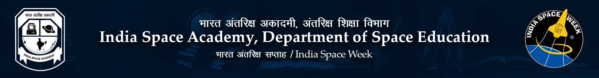

# Amateur's Heliophysics Wiki

This repo is built by an amateur(me) to document my learning journey facilitated by the Heliophysics program at ISA. If you want to recommend any changes, please do so by making an issue. All constructive feedback is greatly appreciated.



---

## Expectations & Deliverables

The program is structured into two distinct phases:

* **Phase 1 :** A 15-day intensive lecture cycle covering the fundamentals of solar physics. Attending this phase earns you a  **Training Certificate** .
* **Phase 2:** A 30-day hands-on period to complete **two projects** assigned by the ISA team.
* **Note on Research Scope:** We aren't expected to discover a new solar phenomenon or rewrite textbook physics. The goal is to reproduce established studies and apply modern data analysis techniques to fresh datasets from the Aditya-L1 mission.

---

## Prequisites

1. You must have access to the [ISA LMS Portal](https://isa.internship.indiaspaceweek.org/lms/ "LMS Link") with the credentials that have been provided by the ISA Team. There are two required fields - Email & Enrollment Number. Email is the one that you used to register for the workshop. If you don't happen to know your enrollment number, you can find it here at this particular link: [Find your Enrollment Number]()
2. You must have registered and verified your account on the [Pradan Portal](https://pradan1.issdc.gov.in/al1/). Click on Access data. Further, click on register, and fill in valid details about yourself and your other credentials. In lack of a better username use heliophysics-[your name]. Category can be put as student, designation could be intern or research student and area of expertise can be left to the reader's choice
3. A computer/laptop with [Python 3.11](https://www.python.org/downloads/release/python-3145/) or newer and a few important packages like `<span>Astropy</span>`,`<span>solarpy</span>` and `<span>Sunpy</span>`. All other related dependencies can be installed based on the reader's choice. You will almost certainly want `<span>numpy</span>` for high-performance matrix math, `<span>matplotlib</span>` or `<span>seaborn</span>` for plotting solar graphs, and `<span>pandas</span>` for organizing timeseries data. Install them via your terminal:

```
pip install astropy sunpy solarpy numpy matplotlib pandas
```

4. While the above packages, will help you with most of your applicational work in Heliophysics and help you with handling FITS files, calculating solar radiation or geometry, there are still some topics that require specialized packages. For analyzing CMEs and Solar Flares you need, the PlasmaPy open-source package for analyzing the ASPEX and MAG data from the Aditya L1 Payload.
5. For time series data on magnetic field variation and other physical quantities, we use `<span>pySPEDAS</span>` and a general package for parsing and post-processing satellite data is `<span>pysat</span>`. For managing coordinate geometry, and changing coordinates based on the geo-centric, solar or spacecraft's frame of reference, you can use `<span>SpacePy.</span>`
   Note: For the most part you won't need all of these packages, only a select few.

---

## Introduction

Heliophysics is the scientific study of the Sun's dynamic processes and their influence on the solar system, encompassing solar physics, heliospheric physics, and space weather phenomena. The term "heliophysics" emerged in the late 20th century, formalized by NASA in the 2000s to unify previously fragmented disciplines like solar physics, cosmic ray physics, ionospheric physics, and magnetospheric physics into a cohesive framework. In 2009, NASA release a review catalogue, highlighting solved and unsolved problems in Heliophysics, setting the stage for a roadmap as well. It can act as a reference for finding project ideas, while also providing established answers to questions we might have. [Link](https://explorers.larc.nasa.gov/EX/PDF_FILES/Heliophysics_Roadmap_2009_tagged-quads.pdf)

---

# Study Schedule

This table will be updated each day. The transcripts will be made available as soon as the the videos are uploaded to youtube.

| Day               | Date                    | Topic                           | Key Learning Objectives                                          | Link                                                                 |
| ----------------- | ----------------------- | ------------------------------- | ---------------------------------------------------------------- | -------------------------------------------------------------------- |
| Day 1             | 19 May 2026             | Introduction to Heliophysics    | The Sun’s structure, Solar cycles, and the Heliosphere          | [Lecture](https://youtu.be/XyjVIHMv_RI "Lec 1")/ Transcript                |
| Day 2             | 20 May 2026             | Solar Dynamics & Phenomena      | Understanding Solar Flares, CMEs, and Solar Wind                 | [Lecture](https://youtu.be/5TuKHOD6nuM "Lec 2")/ Transcript                |
| Day 3             | 21 May 2026             | Basics of Space Weather         | Impact of solar activity on Earth's magnetosphere and satellites | [Lecture](https://youtu.be/5TuKHOD6nuM "Lec 3")/ Transcript                |
| Day 4             | 22 May 2026             | Observational Techniques        | Introduction to ground‑based vs space‑based solar telescopes   | [Lecture](https://www.youtube.com/watch?v=dQw4w9WgXcQ "Lec 4")/ Transcript |
| Day 5             | 23 May 2026             | Aditya L1: Mission Overview     | Mission objectives, orbit (L1 point), and significance for ISRO  | [Lecture](https://www.youtube.com/watch?v=dQw4w9WgXcQ)/ Transcript      |
| Day 6             | 24 May 2026             | Payloads of Aditya L1 - Part I  | Deep dive into VELC, SUIT, and ASPEX instruments                 | [Lecture](https://www.youtube.com/watch?v=dQw4w9WgXcQ)/ Transcript      |
| Day 6 (Cancelled) | To be done on Wednesday | Payloads of Aditya L1 - Part II | Understanding PAPA, SoLEXS, HEL1OS, and Magnetometers            | [Lecture](https://www.youtube.com/watch?v=dQw4w9WgXcQ)/ Transcript      |

## Material

I do personally care about having a strong foundation in subject of astrophysics and astronomy, to perform better, but I feel for most of us the required pre-requisites would be all over the place, and to carry out a methodical meticulously planned study regimen will be time taking and not yield the kind of fruits we desire. I refer to the book - An Introduction to Modern Astrophysics by Oxford (Edition 2). You can find this on Z-Lib or Anna's archive. [I have linked it here.](#)  This book gives you a very elaborate introduction to all of modern astrophysics and astronomy. But one must not forget this book is heavy on theory. I myself have not finished the whole book, but I do keep cross-referencing it whenever I want to understand something. This book also doesn't shy away from covering the underlying mathematics and most of it is around the Undergraduate Level.

Now that we spoke about theory, for actually understanding how we apply astrophysics, using human-made hardware and software, I have started reading [Astrophysical Techniques by CR Kitchin](@). This is a very in-depth guide on how we detect, image, profile things related to celestiabl bodies and other astrophysical phenomenon. I aim to finish this cover to cover by the term our project phase begins. This doesn't have a lot of implementation per se, but it sets you up for a solid foundation to full understand why we do things a certain way. I find this book to be very dense, and I do think it will take a while for most to finish this.

A digital course I am studying parallely to finally study and apply computational techniques to existing data is provided by Imad Pasha and Marla Geha at: [Astro 330 Scientific Computing in Astrophysics](https://astro-330.github.io/intro.html)

This has 7 different challenges and they are very easy to complete, with solutions provided to the same.

# Heliophysics Study Schedule

| Day   | Date        | Topic                           | Key Learning Objectives                                          | Link                                                                 |
| ----- | ----------- | ------------------------------- | ---------------------------------------------------------------- | -------------------------------------------------------------------- |
| Day 1 | 19 May 2026 | Introduction to Heliophysics    | The Sun’s structure, Solar cycles, and the Heliosphere          | [Lecture](https://youtu.be/XyjVIHMv_RI "Lec 1")/ Transcript                |
| Day 2 | 20 May 2026 | Solar Dynamics & Phenomena      | Understanding Solar Flares, CMEs, and Solar Wind                 | [Lecture](https://youtu.be/5TuKHOD6nuM "Lec 2")/ Transcript                |
| Day 3 | 21 May 2026 | Basics of Space Weather         | Impact of solar activity on Earth's magnetosphere and satellites | [Lecture](https://youtu.be/5TuKHOD6nuM "Lec 3")/ Transcript                |
| Day 4 | 22 May 2026 | Observational Techniques        | Introduction to ground‑based vs space‑based solar telescopes   | [Lecture](https://www.youtube.com/watch?v=dQw4w9WgXcQ "Lec 4")/ Transcript |
| Day 5 | 23 May 2026 | Aditya L1: Mission Overview     | Mission objectives, orbit (L1 point), and significance for ISRO  | [Lecture](https://www.youtube.com/watch?v=dQw4w9WgXcQ)/ Transcript      |
| Day 6 | 24 May 2026 | Payloads of Aditya L1 - Part I  | Deep dive into VELC, SUIT, and ASPEX instruments                 | [Lecture](https://www.youtube.com/watch?v=dQw4w9WgXcQ)/ Transcript      |
| Day 6 | 24 May 2026 | Payloads of Aditya L1 - Part II | Understanding PAPA, SoLEXS, HEL1OS, and Magnetometers            | [Lecture](https://www.youtube.com/watch?v=dQw4w9WgXcQ)/ Transcript      |

## Related Links Dump
